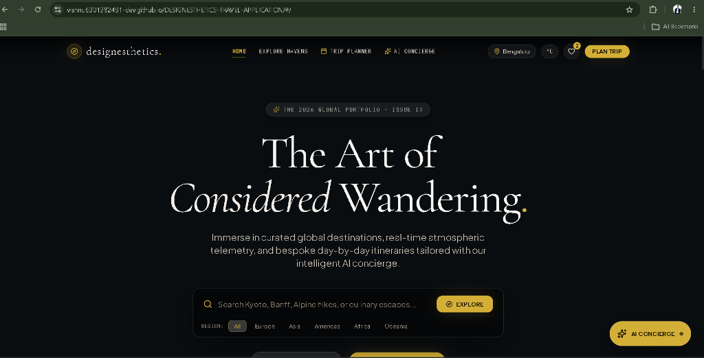
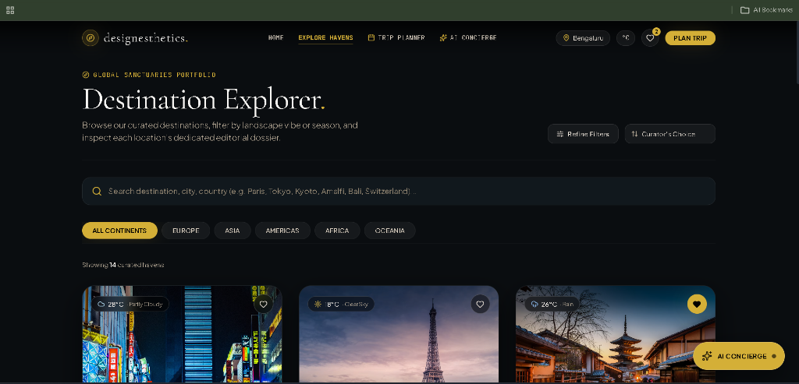

# 🏛️ designesthetics. — Curated Global Destinations & AI Travel Atelier

> **Designesthetics Front-End Developer Assignment Submission**  
> An editorial-grade luxury travel web application built with **React 19**, **TypeScript**, **Tailwind CSS**, and **Framer Motion**, powered by **Google Gemini AI**, **Open-Meteo & OpenWeather Telemetry**, and **Dynamic Travel Photography**.

---

### 🌐 Live Application & Repository
- 🚀 **Live Production Website**: [https://vishnu6301382491-dev.github.io/DESIGNESTHETICS-TRAVEL-APPLICATION/](https://vishnu6301382491-dev.github.io/DESIGNESTHETICS-TRAVEL-APPLICATION/)
- 📦 **Public GitHub Repository**: [https://github.com/vishnu6301382491-dev/DESIGNESTHETICS-TRAVEL-APPLICATION](https://github.com/vishnu6301382491-dev/DESIGNESTHETICS-TRAVEL-APPLICATION)

#### 🧭 Deep Route Navigation:
- **Landing Experience**: [`/#/`](https://vishnu6301382491-dev.github.io/DESIGNESTHETICS-TRAVEL-APPLICATION/#/)
- **Destination Explorer**: [`/#/explore`](https://vishnu6301382491-dev.github.io/DESIGNESTHETICS-TRAVEL-APPLICATION/#/explore)
- **Paris Dossier**: [`/#/destinations/paris`](https://vishnu6301382491-dev.github.io/DESIGNESTHETICS-TRAVEL-APPLICATION/#/destinations/paris)
- **Tokyo Dossier**: [`/#/destinations/tokyo`](https://vishnu6301382491-dev.github.io/DESIGNESTHETICS-TRAVEL-APPLICATION/#/destinations/tokyo)
- **Dubai Dossier**: [`/#/destinations/dubai`](https://vishnu6301382491-dev.github.io/DESIGNESTHETICS-TRAVEL-APPLICATION/#/destinations/dubai)
- **Bali Dossier**: [`/#/destinations/bali`](https://vishnu6301382491-dev.github.io/DESIGNESTHETICS-TRAVEL-APPLICATION/#/destinations/bali)
- **Kyoto Dossier**: [`/#/destinations/kyoto`](https://vishnu6301382491-dev.github.io/DESIGNESTHETICS-TRAVEL-APPLICATION/#/destinations/kyoto)
- **Dedicated AI Trip Planner**: [`/#/planner`](https://vishnu6301382491-dev.github.io/DESIGNESTHETICS-TRAVEL-APPLICATION/#/planner)
- **Dedicated AI Concierge Salon**: [`/#/assistant`](https://vishnu6301382491-dev.github.io/DESIGNESTHETICS-TRAVEL-APPLICATION/#/assistant)

---

## 1. Overview of What Was Built

**designesthetics.** is a luxury travel web application designed for discerning voyagers who value design excellence, cultural authenticity, and thoughtful curation. Guided by visual restraint, architectural typography, and purposeful motion, it replaces generic travel aggregators with an editorial atelier experience.

### Core Architecture & Technical Highlights:
- **Client-Side Routing SPA**: Real multi-route navigation (`/#/`, `/#/explore`, `/#/destinations/:id`, `/#/planner`, `/#/assistant`, `*`) built with `react-router-dom`, providing deep-linking and zero-404 reliability on static hosting.
- **Cinematic Landing Experience**: Looping high-definition drone footage hero with interactive audio controls, editorial vignettes, instant keyword search, and live metrics ticker.
- **Location Awareness & Distance Radar**: Automatic browser Geolocation with reverse geocoding to city/country, real-time Haversine distance calculations (*e.g. "8,420 km from London"*), and a 12-city manual gateway fallback.
- **Atmospheric Weather Telemetry**: Dual weather engine integrating OpenWeather with high-precision Open-Meteo live feeds, featuring °C/°F toggling and climate-adaptive packing advisories.
- **Famous Places & Sacred Wonders**: Notable landmarks presented with high-definition imagery, category tags, admission fees, visit durations, and curator insider tips (not a bare list of names!).
- **Google Gemini AI Travel Concierge**: A conversational travel concierge aware of the destination currently in view, offering suggested prompt chips and travel advice.
- **Structured Day-by-Day AI Itinerary Planner**: Transforms travel parameters into organized morning, afternoon, and evening timeline cards with checklist milestones, confetti celebrations, and clean PDF print export.
- **Production Performance & Resilience**: 0 console errors on static GitHub Pages, sub-5-second bundle builds, progressive image shimmer skeletons, and dedicated fallback telemetry engines.

---

## 2. Screenshots of the Application

### 🎥 Cinematic Landing Experience & Video Hero
*Editorial headline ("The Art of Considered Wandering."), looping drone video background with audio toggle, instant search bar, continent chips, and live departure location telemetry:*



---

### 📍 Destination Explorer & Multi-Dimensional Filtering
*Interactive destination explorer showcasing curated sanctuaries (Tokyo, Paris, Kyoto), continent tabs, live weather telemetry, distance indicators, and refined vibe/budget filters:*



---

## 3. Features Completed

| # | Assignment Requirement | Implementation Details |
| :--- | :--- | :--- |
| **01** | **Landing Experience** | Looping drone background video hero with audio mute/unmute toggle, fallback poster image, headline typography (`Cormorant Garamond`), instant search input, continent filter chips, metrics ticker, and animated scroll indicator. |
| **02** | **Destination Explorer** | Full-featured exploration engine supporting text search (by city, country, vibe, or landmark), 6 continent tabs, 10 travel vibes (*Coastal, Alpine, Heritage, Culinary, Wellness, Adventure, Art & Culture, Architecture, Nature*), and 4 budget tiers (`$`, `$$`, `$$$`, `$$$$`). Includes dynamic sorting (*Curator's Choice, Nearest to You, Highest Rated, Alphabetical*) and designed empty states with "Reset Filters" action. |
| **03** | **Famous Places (Not a Bare List)** | Dedicated landmark cards for every destination featuring rich photography, category badges (*Sacred, Architecture, Nature, Historic, Culinary, Wellness, Adventure*), admission costs, required visit durations, and **Curator's Insider Tips** (best arrival times to avoid crowds, secret viewpoints). |
| **04** | **Location Awareness** | Automatic coordinate detection via `navigator.geolocation` with reverse geocoding to city/country. Real-time Haversine distance radar calculating exact flight distance from the user. Graceful permission denial handling and manual gateway selector with 12 world hubs (*London, New York, Tokyo, Paris, Dubai, Singapore, Sydney, San Francisco, Berlin, Mumbai, Toronto, São Paulo*). |
| **05** | **Real-Time Weather Telemetry** | Dual weather engine: OpenWeather API + Open-Meteo live public telemetry fallback (works out of the box with zero API keys required and zero console 404s!). Displays live temperature, conditions, humidity, wind speed, feels-like temperature, and UV index. Features a persistent °C/°F unit toggle and **Climate-Adaptive Wardrobe Advice**. |
| **06** | **Dynamic Image Sourcing** | Dynamic query resolution via Unsplash and Pexels with progressive blur-up shimmer skeletons, image error handlers, and curated high-resolution CDN fallbacks to prevent broken image states. |
| **07** | **Google Gemini AI Concierge** | Context-aware travel assistant powered by Google Gemini. Automatically receives the active destination context, provides suggested quick-prompt chips (*"How long to stay?", "Must-see sights", "Packing tips"*), and formats responses in markdown. Includes an intelligent local travel synthesis engine for offline/fallback resilience. |
| **08** | **Structured AI Itinerary Planner** | Dedicated trip configuration page on [`/#/planner`](https://vishnu6301382491-dev.github.io/DESIGNESTHETICS-TRAVEL-APPLICATION/#/planner) allowing customization of destination, duration (1–7 days), travel aesthetic, pace, travel party, and interests. Generates **structured Day-by-Day schedules with distinct Morning, Afternoon, and Evening cards** (not a wall of chatbot text!). Includes interactive checklist completion with confetti celebrations, copy-to-Markdown, and print-to-PDF export. |
| **09** | **Real Client Routing** | Multi-route Single Page Application using `react-router-dom`: `/`, `/explore`, `/destinations/:id`, `/planner`, `/assistant`, and a luxury 404 page. Fully compatible with GitHub Pages static hosting. |
| **10** | **Design System & Accessibility** | Editorial palette (Noir `#0A0D10`, Parchment `#EAE2D8`, Champagne Gold `#D4AF37`, Azure `#38BDF8`), semantic HTML5 tags, visible `:focus-visible` rings, `Escape` key dialog dismissal, `aria-label` on icon controls, and respect for `prefers-reduced-motion`. |

---

## 4. Instructions on How to Run the Project

### Prerequisites
Make sure you have the following installed on your machine:
- **Node.js**: v18.0.0 or later (tested on v20.x & v24.x)
- **npm**: v9.0.0 or later (or `pnpm` / `yarn`)
- **Git**

---

### Step 1: Clone the Repository
```bash
git clone https://github.com/vishnu6301382491-dev/DESIGNESTHETICS-TRAVEL-APPLICATION.git
cd DESIGNESTHETICS-TRAVEL-APPLICATION
```

---

### Step 2: Install Dependencies
Install all required production and development dependencies:
```bash
npm install
```

---

### Step 3: Configure Environment Variables (Optional)
The application works **100% out of the box without any API keys** thanks to built-in fallback telemetry engines (Open-Meteo live weather + curated high-resolution CDNs + local AI synthesis).

To connect live personal API keys, copy the `.env.example` file:
```bash
cp .env.example .env
```

Edit `.env` with your API credentials:
```env
# Google Gemini API Key (For live AI Concierge & Itinerary generation)
VITE_GEMINI_API_KEY=your_google_gemini_api_key

# OpenWeather API Key (Optional: Open-Meteo live telemetry runs automatically if omitted)
VITE_OPENWEATHER_API_KEY=your_openweather_api_key

# Unsplash Access Key (Optional: Dynamic travel photography lookups)
VITE_UNSPLASH_ACCESS_KEY=your_unsplash_access_key

# Pexels API Key (Optional)
VITE_PEXELS_API_KEY=your_pexels_api_key
```

> 🔒 **Security Guarantee**: `.env` and `.env*.local` files are strictly excluded via `.gitignore` to ensure secret keys are never committed to version control.

---

### Step 4: Start the Local Development Server
Launch Vite's hot-reloading development server:
```bash
npm run dev
```

Open your browser and navigate to:
```
http://localhost:5173
```

---

### Step 5: Build for Production
To compile and bundle the application into optimized static assets:
```bash
npm run build
```
This produces a minified, type-checked distribution in the `dist/` directory (JavaScript: ~422 kB, CSS: ~37 kB).

To test the compiled production build locally:
```bash
npm run preview
```

---

### Step 6: Deploying to GitHub Pages
To deploy your own build to GitHub Pages:
```bash
npm run deploy
```
This runs `npm run build` and automatically pushes the compiled `dist/` directory to the `gh-pages` branch using the `gh-pages` package.

---

## 🛠️ Technology Stack

| Layer | Technologies |
| :--- | :--- |
| **Frontend Framework** | React 19, TypeScript (~6.0) |
| **Routing** | React Router v7 (`react-router-dom`) |
| **Build Tool & Bundler**| Vite 8 |
| **Styling & Design** | Tailwind CSS 3.4, PostCSS, Autoprefixer |
| **Typography** | Cormorant Garamond (Editorial Serif), Plus Jakarta Sans (UI Sans), JetBrains Mono |
| **Motion & Micro-interactions** | Framer Motion, Canvas-Confetti |
| **Iconography** | Lucide React |
| **APIs & Data Services** | Google Gemini API, Open-Meteo Live API, OpenWeather API, Unsplash API, Pexels API, Browser Geolocation |

---

## 📄 License & Attribution
- Built for the **Designesthetics Front-End Developer Assignment**.
- Designed & Developed by **Vishnu** ([@vishnu6301382491-dev](https://github.com/vishnu6301382491-dev)).
